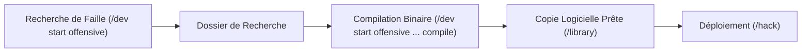

# 🛡️ Manuel de Cyberguerre — Root OS PvP V2

Bienvenue dans la nouvelle ère de **Root OS**. Le système PvP a été entièrement repensé : fini les points d'attaque abstraits et les tirages aléatoires de secret ID. Désormais, vous concevez, compilez, échangez et déployez de véritables **logiciels malveillants** et **correctifs de sécurité**.

---

## 📑 Sommaire
1. [Concepts Fondamentaux & Empreintes](#1-concepts-fondamentaux--empreintes)
2. [Phase 1 : Reconnaissance & Sondage Réseau (`/scan`)](#2-phase-1--reconnaissance--sondage-réseau-scan)
3. [Phase 2 : Cycle de Recherche & Développement (`/dev` & `/library`)](#3-phase-2--cycle-de-recherche--développement-dev--library)
4. [Phase 3 : Déploiement Offensif (`/hack`)](#4-phase-3--déploiement-offensif-hack)
5. [Les 6 Familles de Malwares](#5-les-6-familles-de-malwares)
6. [Défense, Diagnostic & Analyse de Trace (`/diag`, `/trace`)](#6-défense-diagnostic--analyse-de-trace-diag-trace)
7. [Le Marché Souterrain (`/market`)](#7-le-marché-souterrain-market)
8. [Lexique & Répertoire des Commandes](#8-lexique--répertoire-des-commandes)

---

## 1. Concepts Fondamentaux & Empreintes

Dans Root OS V2, chaque faille de sécurité découverte possède une **Empreinte Unique** de 4 caractères (ex. `[K7M2]`, `[P3RX]`).

- **Dossier de Recherche** : Votre propriété intellectuelle. Il vous permet de compiler autant de copies logicielles que vous le souhaitez.
- **Logiciel Compilé (Copie)** : Le programme prêt à l'emploi. Chaque attaque consomme une copie utilisable.
- **Patch (Correctif)** : Un module défensif conçu pour neutraliser définitivement une empreinte précise sur votre réseau.
- **Canaux Indépendants** : Vous disposez de deux canaux de travail simultanés :
  - Canal **Offensif** (consomme la puissance de vos modules d'attaque `attack_t*`).
  - Canal **Défensif** (consomme la puissance de vos modules de défense `bay_defense_t*`).

---

## 2. Phase 1 : Reconnaissance & Sondage Réseau (`/scan`)

Avant de frapper, vous devez analyser l'infrastructure adverse.

- **Commande** : `/scan @cible` ou `!scan @cible`
- **Coût** : 0.005 RTM · **Délai** : 90 secondes.
- **Règles d'éligibilité** :
  - Infrastructure de niveau 1 minimum requise.
  - Vous ne pouvez cibler que des infrastructures de niveau supérieur ou égal au vôtre (sauf en cas de **droit de représailles** actif < 72h).
- **Rapport de Reconnaissance (reçu en Message Privé)** :
  - Niveau d'infrastructure adverse et points de défense passifs.
  - Inventaire du matériel minier (Tiers et hashrate total).
  - Taux de remplissage de la mémoire vive (RAM).
  - Signatures des logiciels et correctifs déjà déployés.

---

## 3. Phase 2 : Cycle de Recherche & Développement (`/dev` & `/library`)

Pour mener une cyberattaque ou vous protéger, vous devez concevoir vos programmes.



### Étape A : Trouver une Vulnérabilité
Lancez une recherche sur un canal offensif pour un type de malware et un Tier donné :
```
/dev start job_type:research channel:offense family:hostile_miner tier:2
!dev start research hostile_miner 2
```
*À la fin du job, vous obtenez un Dossier de Recherche avec une empreinte unique (ex: `[K7M2]`).*

### Étape B : Compiler des Copies Utilisables
Compilez votre dossier pour créer un binaire déployable :
```
/dev start job_type:compile channel:offense family:hostile_miner tier:2
!dev start compile hostile_miner 2
```

### Étape C : Consulter votre Bibliothèque
Vérifiez vos dossiers, copies logicielles prêtes et patches avec :
```
/library
!library
```

---

## 4. Phase 3 : Déploiement Offensif (`/hack`)

Une fois votre logiciel compilé, vous pouvez lancer l'infection.

- **Commande** : `/hack target:@cible family:<famille> [tier:<tier>] [confirm:confirm]`
- **Commande Préfixe** : `!hack @cible [famille] [tier] [confirm]`
- **Ralentissement Défensif** :
  L'installation se déroule en tâche de fond de façon furtive. Plus la cible a de défense de baie (`bay_defense`), plus l'installation prend du temps :
  $$\text{Durée Effective} = \text{Durée Base} \times \left(1 + \frac{\text{DEF Cible}}{500}\right) \quad (\text{Plafonnée à } \times 10)$$
- **Limites d'engagement** :
  - 1 seule opération active par famille.
  - 3 opérations offensives actives simultanées au maximum.

---

## 5. Les 6 Familles de Malwares

| Famille | Effet sur la victime | Durée / Résolution |
| :--- | :--- | :--- |
| **Hostile Miner** | **Siphonne 15%** de la production brute de la baie ciblée directement vers votre RAM. | Persistant jusqu'à installation du patch adapté. |
| **Ransomware** | **Chiffre le réseau** et bloque les commandes économiques (`buy`, `upgrade`, `compile`, `trade`, etc.). Rançon fixée en RTM. | Débloqué dès paiement (`/pay`) ou pose de patch (max 72h). |
| **Vol de Devises** (`currency_theft`) | **Dérobe instantanément 25%** du solde USD de la victime (plancher de 50$ protégé, 5% de frais de place). | Immédiat à la livraison. |
| **Saturation RAM** (`saturation`) | **Réduit de 30%** la vitesse de calcul du canal de recherche offensif adverse. | 6 heures (plafonné à 60% si attaques multiples). |
| **Espionnage** (`espionage`) | Génère une **cartographie discrète** (*directory*) de tous les logiciels, dossiers et patches adverses. | Rapport instantané délivré en DM. |
| **Vol de Logiciel** (`software_theft`) | **Copie un logiciel compilé** présent chez la cible pour votre inventaire (`resellable=0`). | Immédiat à la livraison. |

---

## 6. Défense, Diagnostic & Analyse de Trace (`/diag`, `/trace`)

### 1. Diagnostic d'Intégrité Réseau (`/diag` ou `/hack diag`)
Si vous constatez une anomalie ou une baisse suspecte de rendement, lancez un diagnostic (coût : 0.001 RTM).
Il liste l'ensemble des signatures hostiles actives sur vos machines et leurs empreintes `[ABCD]`.

### 2. Développement & Installation d'un Patch
Dès qu'une empreinte est identifiée (ex. `[K7M2]`) :
1. Développez le correctif défensif :
   ```
   /dev start job_type:patch_research channel:defense family:hostile_miner fingerprint:K7M2
   !dev start patch_research hostile_miner K7M2
   ```
2. Installez le patch depuis `/library` pour éradiquer l'infection et vous immuniser définitivement contre cette empreinte.

### 3. Analyse de Trace Réseau (`/trace` ou `/hack trace`)
Tentez de remonter le signal pour découvrir qui vous attaque (coût : 0.002 RTM).
- Si l'attaquant n'a pas patché son propre réseau, son identité est démasquée !
- Vous obtenez immédiatement un **Droit de Représailles de 72h** pour le contre-attaquer sans restriction de niveau d'infrastructure.

### 4. Payer une Rançon (`/pay` ou `/hack pay`)
Si votre système est paralysé par un Ransomware et que vous n'avez pas encore le patch, payez la rançon en RTM demandée pour débloquer instantanément vos commandes.

---

## 7. Le Marché Souterrain (`/market`)

Le marché permet aux hackers et défenseurs de monétiser leurs recherches ou d'acheter des solutions clés en main.

- **Articles autorisés à la vente** :
  - Logiciels compilés légitimes (non volés).
  - Patches défensifs non encore installés.
  - Dossiers de recherche offensifs.
- **Règles & Sécurité** :
  - Frais de marché de **5%** prélevés lors de la vente.
  - Maximum **5 annonces simultanées** par vendeur.
  - L'article est immédiatement réservé pour éviter les fraudes.

### Commandes du Marché :
- `/market list [type]` ou `!market list` : Consulter les offres.
- `/market mine` ou `!market mine` : Voir ses propres annonces.
- `/market sell <type> <id> <prix>` ou `!market sell software 12 500` : Vendre un article.
- `/market buy <listing_id>` ou `!market buy 4` : Acheter une annonce.
- `/market cancel <listing_id>` ou `!market cancel 4` : Retirer son annonce.

---

## 8. Lexique & Répertoire des Commandes

| Commande | Alias | Description |
| :--- | :--- | :--- |
| `/scan <@cible>` | `!scan` | Sonde le réseau adverse (rapport complet en MP). |
| `/hack <@cible>` | `!hack`, `!hk` | Déploie un logiciel malveillant sur la cible. |
| `/diag` | `!diag`, `!hack diag` | Diagnostic des flux et détection des malwares actifs. |
| `/trace` | `!trace`, `!hack trace` | Remonte la trace réseau pour identifier l'attaquant (72h de représailles). |
| `/pay` | `!pay`, `!hack pay` | Règle la rançon pour libérer un réseau sous Ransomware. |
| `/dev start` | `!dev start` | Démarre un travail de recherche, compilation ou correctif. |
| `/library` | `!library` | Ouvre votre coffre-fort de logiciels, dossiers et patches. |
| `/market` | `!market`, `!mkt` | Accède à la bourse d'échange et de vente entre joueurs. |

---
*Root OS • Système sécurisé • Protocole Cyberguerre V2*
